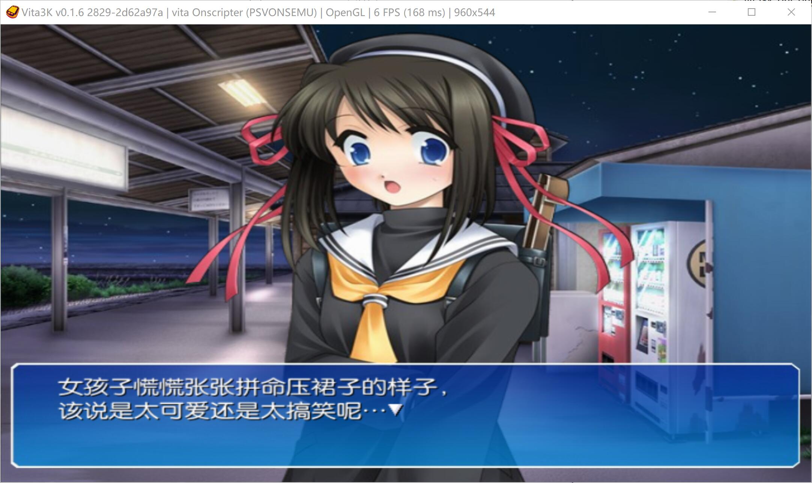
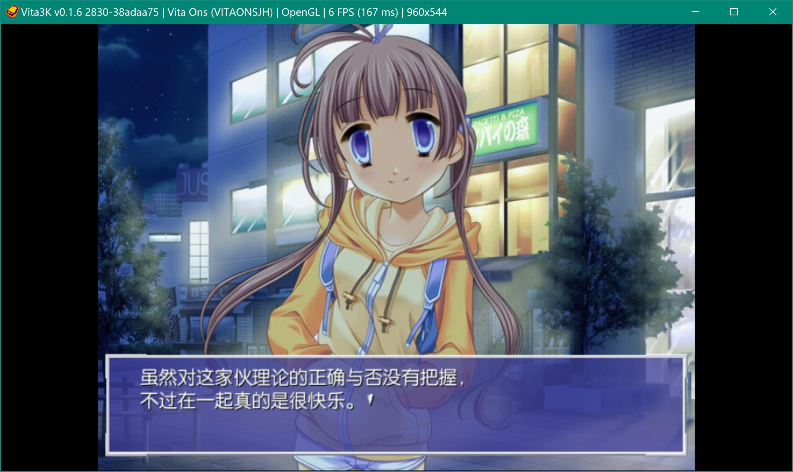
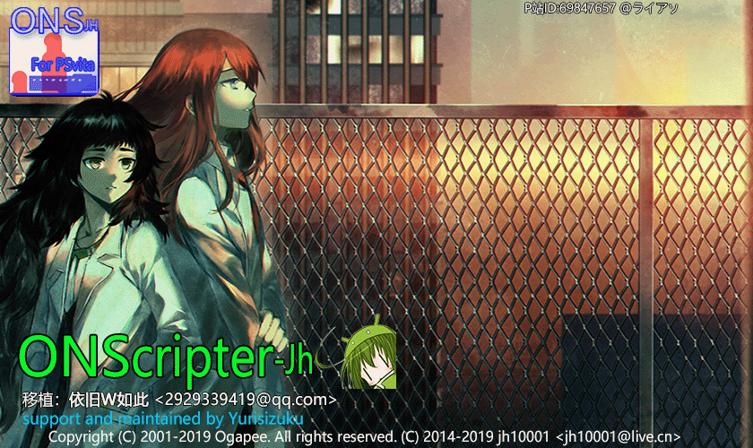

# ONScripter-jh-PSVita (yuri)  

  

This is an ONScripter JH (SDL2) project, ported to psv.  
Maintained by Yurisizuku, optimizing code structure and adding more features.

- [x] make better structure by cmake
- [x] fix bugs in new vitasdk and rendering problems
- [x] fix bugs for joystick and touching event (this is caused by the scale ratio in y)
- [x] ci in github  action to automaticly build
- [ ] support `nt2`, `nt3` script format
- [ ] support mpeg video
- [ ] make compatible game list
...





My other mod for emulators:  
[Mine_v1.5_yuri in andorid](https://github.com/YuriSizuku/Kirikiroid2/releases/download/1.3.9_yuri/Kirikiroid2_yuri_1.3.9.apk)  
[Krkrdorid in andorid](https://github.com/YuriSizuku/Kirikiroid2/releases/download/1.3.9_yuri/Kirikiroid2_yuri_1.3.9.apk)  

## 1. build

Instal [vitasdk](https://vitasdk.org/) first, and then use these script to build and debug.  
I tested it with windows msys `sh` and linux `bash`.  

```sh
#install vitasdk
sh ./script/install_vitasdk.sh [vitasdkdir]

# build script
sh ./script/build_vitavpk.sh vpk [vitasdkdir]

# send script
sh send_vitavpk.sh ./../build/vita_onscripter.vpk 10.2.12.6 PSVONSEMU
sh build_vitavpk.sh all && sh send_vitaeboot.sh 10.2.12.6
```

## 2. usage

Put ons games into `ux0:onsemu/` and enjoy 🍀  
The game directory should not contain non-asci charactors.  
See original informations in details.  


## 3. konwn issues

- [x] cmake 3.24.2 generate wrong target (like `onsjh.self-self`), use 3.16.x instead.  
  Solved by [branch cmake](https://github.com/vitasdk/vita-toolchain/issues/215)  
- [x] Some game `*** can't load file [fgimage/CGTM16.png] Out of memory ***`  
    This is because vita homebrew heap size has restriction to 32M.  
    Solved by override [strbrk](https://gitee.com/yizhigai/onscripter-vita/blob/master/onscripter/vita/sbrk.c)  

------
Original informations by [wetor](https://github.com/wetor/ONScripter-jh-PSVita).  
Thank you for providing the code and makefiles to this project.

## 2019.3.3 上传部分源代码  

现在暂无法编译，源代码还在整理中...  
GUI源代码(太乱了)和makefile会在整理完后上传，大学狗没什么时间，可能会鸽一段时间  

## 详细信息  

[beta0.2版本下载](https://blog.wetorx.cn/posts/ONS-PSV/)  
[更新日志请访问](https://blog.wetorx.cn/posts/ONS-PSV/)  
[目前已知BUG列表](https://blog.wetorx.cn/posts/ONS-PSV/)  

## 感谢

感谢 小凱（@kane33936）一直以来的支持！  
感谢 jh10001 对我一些可笑问题的解答！  
感谢 唯一、小凱、光影的初期协助测试！  

## 源代码支持

ONScripter-jh 作者：jh10001（@jh2711H）  
SDL2-Vita 和 SDL2相关库（ttf、mixer、image） 作者：rsn8887  
VitaShell 作者：TheOfficialFloW（TheFlow）  
vita-savemgr 作者：d3m3vilurr  
vhbb 作者：devnoname120  
vitacompanion 作者：devnoname120  
debugnet 作者：psxdev  
sdlpal-vita 作者：usineur  
iniparser 作者：ndevilla  
libvita2d 作者：xerpi  
vita-luajit 作者：hyln9  
VITASDK  
Vita3K  
更多待补充。
